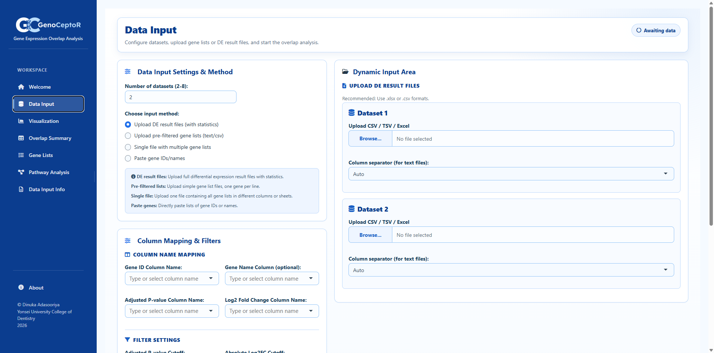
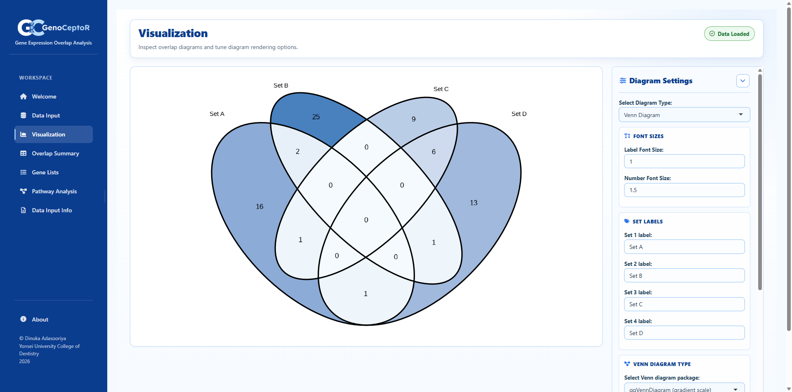
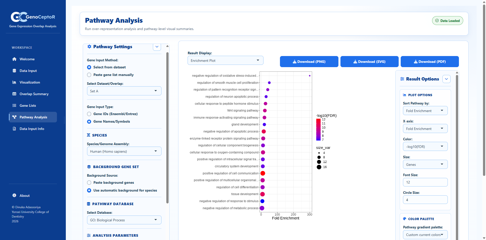

<p align="center">
  
</p>

# GenoCeptR

<p align="center">
  
  
  
</p>

**GenoCeptR** is an interactive **R Shiny** application for exploring overlaps
between differential gene expression (DE) result sets and running downstream
pathway enrichment analysis — all in one workspace.

Developed by **Dinuka Adasooriya**, Yonsei University College of Dentistry, Seoul, Korea.

---

## Key Features

### Data Input
- Analyze **2–5 datasets** in a single session.
- Two input modes:
  1. **Upload DE result files** (`.csv`, `.tsv`, `.txt`, `.xlsx`) with automatic
     separator/sheet detection and column auto-mapping (gene ID, gene name,
     adjusted p-value, log2 fold-change).
  2. **Paste pre-filtered gene lists** (one gene per line, per dataset).
- Adjustable significance (adjusted p-value) and |log2FC| cutoffs, plus an
  optional up/down **gene direction filter**.

### Set Overlap Visualization
- **Venn diagrams** (2–5 sets) via `ggvenn` / `ggVennDiagram` / `VennDiagram`.
- **Interactive Venn diagram** (Plotly-based, with custom hover panels).
- **Euler diagrams** (`eulerr`) — area-proportional alternative to Venn.
- **UpSet plots** (`UpSetR`) for higher-dimensional overlaps.
- **Edwards' Venn diagrams**.
- Full customization: labels, fill colors (including colorblind-friendly
  palettes), font sizes, titles.
- Exports: PNG, SVG, PDF, and interactive HTML.

### Overlap Summaries & Gene Lists
- Per-dataset and per-intersection numeric summaries.
- Interactive, searchable gene tables (`DT`) with aggregated adjusted p-value
  and log2FC per gene.
- Downloadable gene lists and summaries (CSV / TXT).

### Pathway Enrichment Analysis
- Over-representation analysis (ORA) via `gprofiler2::gost()` against GO,
  KEGG, Reactome, and other supported databases.
- Run enrichment directly on any dataset or overlap region generated in the
  Venn/Euler/UpSet workspace, with an optional gene-direction (up/down) filter.
- Results as sortable/searchable tables, bar/dot/lollipop plots, dendrogram
  trees, and gene–pathway networks.
- Exports: plots (PNG/SVG/PDF), tables (CSV), network nodes/edges (CSV), and
  interactive network (HTML).

---

## Getting Started

### Requirements
- R (≥ 4.2 recommended)
- RStudio (optional, `.Rproj` file included)

### Install dependencies

```r
pkgs <- c(
  "shiny", "bslib", "shinyjs", "colourpicker", "VennDiagram", "ggvenn",
  "dplyr", "DT", "shinyWidgets", "readxl", "openxlsx", "UpSetR", "eulerr",
  "ggplot2", "showtext", "ggVennDiagram", "plotly", "htmlwidgets"
)
install.packages(pkgs)

# Optional, enables Pathway Analysis tab and network graphs
install.packages(c("gprofiler2", "ggdendro", "visNetwork", "igraph", "scales"))
```

### Run the app

```r
shiny::runApp("path/to/GenoCeptR")
```

or open `GenoCeptR.Rproj` in RStudio and run `run_app.R`, or click **Run App**.

---

## Project Structure

```
GenoCeptR/
├── app.R                 # Shiny entry point (UI + server)
├── global.R              # Package loading, module/util sourcing
├── run_app.R             # Standalone launcher
├── DESCRIPTION           # Package metadata / dependencies
├── modules/              # UI and server modules
│   ├── ui_styles.R
│   ├── ui_sidebar.R
│   ├── ui_tabs.R
│   ├── ui_pathway.R
│   ├── server_data_input.R
│   ├── server_data_input_generate.R
│   ├── server_plotting.R
│   ├── server_downloads.R
│   ├── server_downloads_overlaps.R
│   ├── server_outputs.R
│   └── server_pathway.R
├── utils/                 # Shared utility functions
│   ├── file_utils.R
│   ├── palette_utils.R
│   ├── overlap_utils.R
│   ├── plot_utils.R
│   └── pathway_utils.R
└── www/                   # Static assets (logos, images)
```

## Input Data Format

Supported DE result file formats: `.csv`, `.tsv`, `.txt`, `.xlsx`. Files
should contain at minimum a gene identifier column; adjusted p-value and
log2 fold-change columns are required to use significance/direction
filtering and are used to annotate the Pathway Analysis and Gene List tabs.

## Screenshots

<p align="center">
  <br><br>
  <br><br>
  
</p>

## License

Released under the [MIT License](LICENSE).

## Changelog

See [CHANGELOG.md](CHANGELOG.md) for version history.
